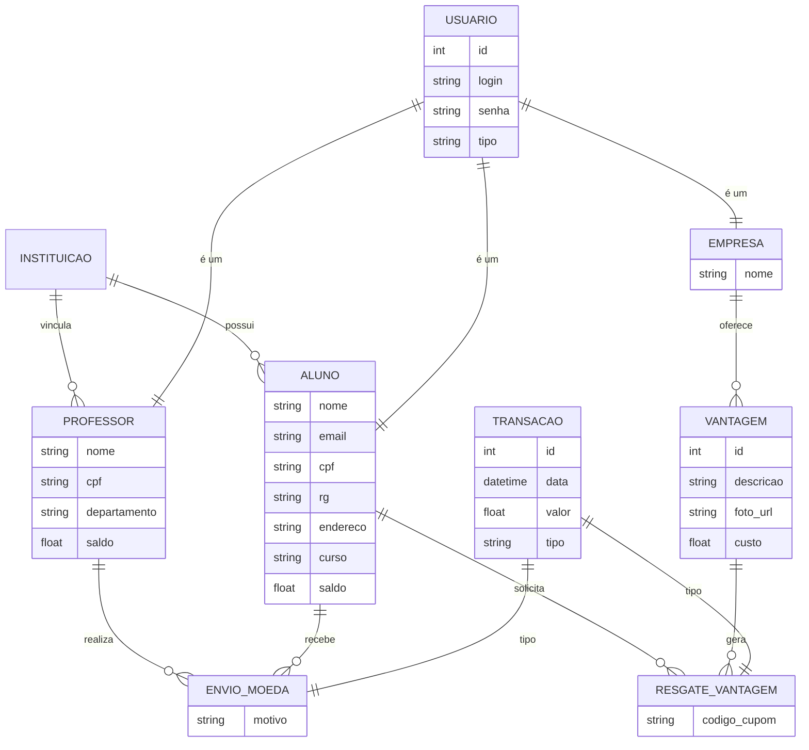

# PUCPay - Sistema de Moeda Estudantil


## 📝 Descrição do Projeto

O **PUCPay** é uma plataforma gamificada de mérito estudantil que visa estimular o engajamento e o reconhecimento dos alunos através de uma moeda virtual. Professores podem distribuir moedas como recompensa por desempenho e comportamento, enquanto alunos podem trocar essas moedas por benefícios exclusivos oferecidos por empresas parceiras.

Este sistema foi desenvolvido como parte das atividades da disciplina de Laboratório de Desenvolvimento de Software.

---

## 👥 Participantes

- **Davi Nunes Carvalho**
- **Joao Victor Russo Marquito**

---

## 🚀 Funcionalidades Principais

### 🎓 Para Alunos
- **Cadastro Completo**: Inclusão de dados pessoais (CPF, RG, Endereço) e vínculo com Instituição e Curso.
- **Consulta de Extrato**: Visualização detalhada de moedas recebidas e trocas realizadas.
- **Resgate de Vantagens**: Troca de moedas por descontos em mensalidades, materiais ou alimentação.
- **Notificações**: Recebimento de alertas por e-mail a cada nova moeda ganha ou vantagem resgatada.

### 👨‍🏫 Para Professores
- **Distribuição de Moedas**: Envio de até 1.000 moedas por semestre (acumuláveis) para alunos, com justificativa obrigatória.
- **Gestão de Saldo**: Acompanhamento do saldo disponível para distribuição.
- **Histórico de Envios**: Consulta de todas as transações realizadas para seus alunos.

### 🏢 Para Empresas Parceiras
- **Cadastro de Vantagens**: Registro de ofertas com descrição, foto e custo em moedas.
- **Gestão de Parceria**: Acesso ao sistema para validar códigos de cupons apresentados pelos alunos.
- **Notificações de Resgate**: Recebimento de e-mail com código de conferência a cada troca realizada.

---

## 🏗️ Arquitetura do Projeto

O sistema segue uma arquitetura moderna e escalável, utilizando o padrão **MVC (Model-View-Controller)** no backend e uma separação clara de responsabilidades.

### Divisão de Pastas (Backend Java/Spring)

```text
src/
├── main/
│   ├── java/com/pucpay/
│   │   ├── config/          # Configurações de Segurança (JWT), E-mail e Swagger
│   │   ├── controllers/     # Pontos de entrada da API (Endpoints REST)
│   │   ├── dtos/            # Objetos de Transferência de Dados (Request/Response)
│   │   ├── exceptions/      # Tratamento global de erros e exceções customizadas
│   │   ├── models/          # Entidades do Banco de Dados (JPA/Hibernate)
│   │   ├── repositories/    # Interfaces de acesso ao banco (Spring Data JPA)
│   │   └── services/        # Lógica de negócio e integrações
│   └── resources/
│       ├── static/          # Arquivos estáticos (CSS, Imagens do Sistema)
│       ├── templates/       # Templates de e-mail (Thymeleaf/FreeMarker)
│       └── application.yml  # Configurações de ambiente e banco de dados
```

---

## 📊 Modelagem do Sistema

### Diagrama Entidade-Relacionamento (ER)

Abaixo, apresentamos a representação das entidades e seus relacionamentos baseada nas regras de negócio do sistema:



---

## 🛠️ Tecnologias Utilizadas

- **Backend**: Java 17+, Spring Boot 3.x
- **Persistência**: PostgreSQL / Hibernate
- **Segurança**: Spring Security & JWT
- **E-mail**: Spring Mail (SMTP/SendGrid)
- **Documentação**: Swagger (OpenAPI)
- **Frontend**: React.js / Vite (Proposta)

---

## ⚙️ Como Executar

1. **Pré-requisitos**: JDK 17, Maven e PostgreSQL instalados.
2. **Configuração**: Ajuste as credenciais do banco em `src/main/resources/application.yml`.
3. **Execução**:
   ```bash
   mvn spring-boot:run
   ```
4. **Acesso**: A API estará disponível em `http://localhost:8080`.